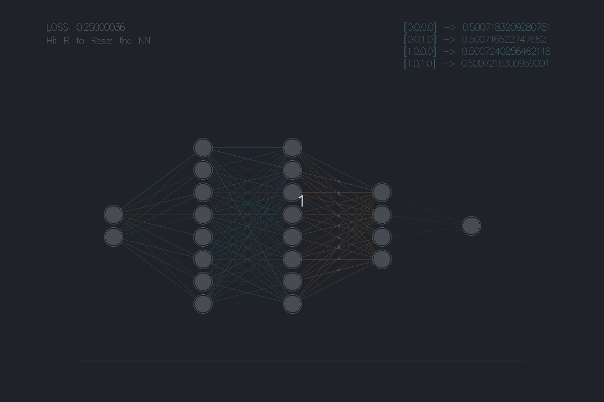

# 🧠 5-Layer Neural Network
### *Deep Learning from Scratch, Visualized in Haskell*

<p align="center">
  
</p>

A high-performance, real-time window into the "thinking" process of a Deep Neural Network. This isn't just a black box—it's a live look at a machine learning XOR logic using pure functional programming.

---

## 🤖 The Engine (The Math)

The network is a chain of matrix transformations. Every neuron is a tiny calculator performing:

$$Output = \sigma(\sum(Input \cdot Weight) + Bias)$$

* **Weights ($W$):** The synapses. Visualized as **cyan** (strong positive) and **orange** (strong negative) connections.
* **Backpropagation:** The math behind the magic. The network calculates the **Gradient** ($\nabla C$) to determine how to nudge weights to reduce error.
* **Cost Function:** We use **Mean Squared Error** to quantify the "confusion":
    $$MSE = \frac{1}{n} \sum (actual - predicted)^2$$


---

## 🎮 Interactive Controls

| Key | Action | Visual Feedback |
| :--- | :--- | :--- |
| **`R`** | **Reset Brain** | Scrambles weights; watch the loss graph spike. |
| **`Watch`** | **Signal Flow** | White sparks trace paths through high-weight connections. |
| **`Analyze`** | **Loss Graph** | The green line tracks "confusion." Flatline = Convergence. |

---

## 📂 Project Structure

```text
.
├── Assets/           
│   └── NeuralNetwork.gif
├── Main.hs           
├── NeuralNet.hs      
├── .gitignore        
└── README.md
```

---

## 🚀 Run it

Get the Dependencies:

```Bash
cabal update
cabal install gloss
```

Build & Fire it up:

```Bash
ghc -O2 Main.hs -o main
./main
```

[!TIP] Running on a potato? If your FPS stutters, open ``Main.hs``, find the ``step`` function, and change the training iterations from ``!! 10`` to ``!! 5``. Your CPU will thank you.

---

## ⚖️ License & Disclaimer

Built for educational purposes. This is a "vanilla" implementation—no heavy ML frameworks, no TensorFlow, no PyTorch. Just raw Haskell and pure math.

---

Built by [mazerissa](https://github.com/mazerissa)